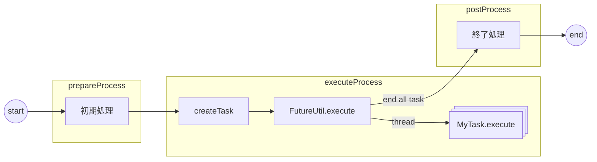

# Tsurugi Template Batch

## 処理内容
処理フロー


- prepareProcess
  - 事前の処理を行います。サンプルではデータをクリアし、新規に登録します。
- executeProcess
  - createTask
    - 芸列実行を行うタスクオブジェクトを作成します。並列実行ではこのオブジェクトの情報のみで実行するため必要な情報をオブジェクトに格納します。
  - FutureUtil.execute
    - 芸列実行のユーティリティ。引数で渡したオブジェクトを指定された芸列数で熟考します。
  - MyTask.execute
    - 並列実行されるロジックを実装します。executeがトランザクションの単位となります。
- postProcess
  - 終了処理を行います。このサンプルでは何も行っていません。

## ビルド・デプロイ
ビルド
```shell
cd tsurugi-batch-template
./gradlew build
```
デプロイ

適当なディレクトリでビルドで生成された tar を解凍します。

```shell
cd yyy
tar xf ~/github/tsurugi-batch-template/app/build/distributions/app-0.1.0.tar
```

## 実行
Tsurugiを起動しておきます。ここでは Docker container で起動し、tcp://localhost:12345 で接続できるようにしておきます。

実行

```shell
./app-0.1.0/bin/app 
```

実行ログ

以下のようなログが出力されます。
MyTaskが並列で実行されていることが確認できます。
```shell
10:39:21.589 [main] INFO  j.g.j.n.tbt.app.batch.TemplateBatch - TemplateBatch started
10:39:21.622 [main] INFO  j.g.j.n.tbt.app.batch.TemplateBatch - TemplateBatch main start
10:39:21.887 [main] INFO  j.g.j.n.tbt.app.batch.TemplateBatch - delete SampleTable num=10
10:39:21.913 [main] INFO  j.g.j.n.tbt.app.batch.TemplateBatch - TemplateBatch main prepareProcess exucuted
10:39:21.945 [main] INFO  j.g.j.n.tbt.app.batch.TemplateBatch - task num=10
10:39:21.953 [pool-1-thread-6] INFO  j.g.j.nkzw.tbt.app.task.MyTask - start int_col1=6
10:39:21.953 [pool-1-thread-5] INFO  j.g.j.nkzw.tbt.app.task.MyTask - start int_col1=5
10:39:21.953 [pool-1-thread-2] INFO  j.g.j.nkzw.tbt.app.task.MyTask - start int_col1=2
10:39:21.954 [pool-1-thread-4] INFO  j.g.j.nkzw.tbt.app.task.MyTask - start int_col1=4
10:39:21.956 [pool-1-thread-7] INFO  j.g.j.nkzw.tbt.app.task.MyTask - start int_col1=7
10:39:21.957 [pool-1-thread-3] INFO  j.g.j.nkzw.tbt.app.task.MyTask - start int_col1=3
10:39:21.958 [pool-1-thread-1] INFO  j.g.j.nkzw.tbt.app.task.MyTask - start int_col1=1
10:39:21.959 [pool-1-thread-8] INFO  j.g.j.nkzw.tbt.app.task.MyTask - start int_col1=8
10:39:21.973 [pool-1-thread-6] INFO  j.g.j.nkzw.tbt.app.task.MyTask - end exec int_col1=6
10:39:21.973 [pool-1-thread-7] INFO  j.g.j.nkzw.tbt.app.task.MyTask - end exec int_col1=7
10:39:21.973 [pool-1-thread-3] INFO  j.g.j.nkzw.tbt.app.task.MyTask - end exec int_col1=3
10:39:21.973 [pool-1-thread-2] INFO  j.g.j.nkzw.tbt.app.task.MyTask - end exec int_col1=2
10:39:21.973 [pool-1-thread-7] INFO  j.g.j.nkzw.tbt.app.task.MyTask - start int_col1=9
10:39:21.973 [pool-1-thread-4] INFO  j.g.j.nkzw.tbt.app.task.MyTask - end exec int_col1=4
10:39:21.974 [pool-1-thread-2] INFO  j.g.j.nkzw.tbt.app.task.MyTask - start int_col1=10
10:39:21.973 [pool-1-thread-5] INFO  j.g.j.nkzw.tbt.app.task.MyTask - end exec int_col1=5
10:39:21.978 [pool-1-thread-8] INFO  j.g.j.nkzw.tbt.app.task.MyTask - end exec int_col1=8
10:39:21.978 [pool-1-thread-1] INFO  j.g.j.nkzw.tbt.app.task.MyTask - end exec int_col1=1
10:39:21.985 [pool-1-thread-7] INFO  j.g.j.nkzw.tbt.app.task.MyTask - end exec int_col1=9
10:39:21.985 [main] INFO  j.g.j.n.tbt.app.batch.TemplateBatch - TemplateBatch main executeProcess exucuted
10:39:21.985 [main] INFO  j.g.j.n.tbt.app.batch.TemplateBatch - TemplateBatch main postProcess exucuted
10:39:22.001 [main] INFO  j.g.j.n.tbt.app.batch.TemplateBatch - end TemplateBatch 379[ms]
10:39:22.001 [main] INFO  j.g.j.n.tbt.app.batch.TemplateBatch - TemplateBatch main finished
```

## 実行パラメータ変更
endpoint, threadsize を実行時の引数で変更できます。指定できるパラメータとデフォルト値はヘルプで確認できます。

```shell
./app-0.1.0/bin/app --help
Usage: jp.gr.java_conf.nkzw.tbt.app.batch.TemplateBatch [options]
  Options:
    --endpoint
      endpoint for tsurugidb
      Default: tcp://localhost:12345
    --help, -h
      print this message
    --threadsize
      thiread size
      Default: 8
    --timeout
      session time out
      Default: 300
```

スレッドサイズを 1 で実行する場合
```shell
./app-0.1.0/bin/app --threadsize 1
```
