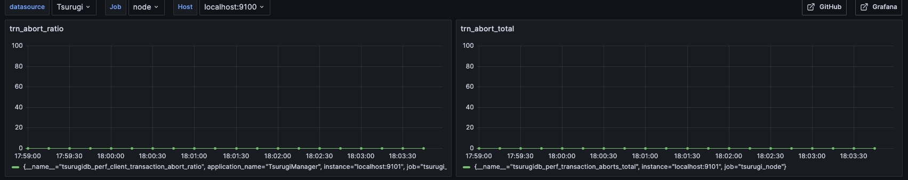
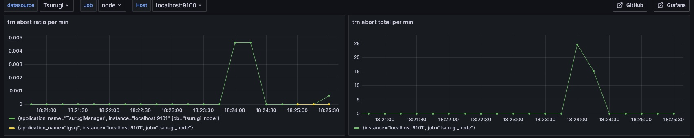
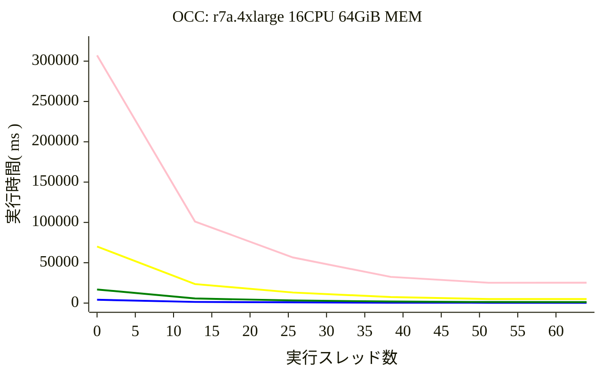

# チケットの席割当時間

- 席:１席１レコードで作成。row（列）seat（席）で表す。全列同じ席数。
- 申込：１申込１レコード。１申込につき席数は１〜４を設定（剰余を利用）。全申込の席数合計は用意した席数と同じとする。完売状態。

割り当て手順（3~5は同じトランザクション）
1. 申込を取得し申込単位で実行 select from applications;
2. 申込ID（登録順）を最大列数で割った余り+1を検索開始列とする。
   - 申込単位でタスクオブジェクトを生成し、そのオブジェクトを並行実行している。
3. 列の空席を検索し、取得した席が申込の席数分連続しているかをチェック。select from seats;
   - 空席は列を指定して取得する。多く取ると確定時に他の空席が埋まったときにコミットエラーとなる。
   - 列が同じなら通路をはんでいても連続としてみている。
4. 連続した席が確保できたら申込のフラグ、席の申込IDをセットして更新して完了。insert into seats; insert into applications;
   - 現実装では前の列の空席もトランザクション内で取得しているので4人連続席を探しているトランザクションには分が悪い。
5. 連続した席がなかった場合には列を＋１して３へ。最後尾に達したら最前列へ、１周してもなかった場合には確保不可で完了。

現在のロジックは簡易ロジックであるため複数スレッドで実行した場合に席数４、３の割り当て不可が発生する確率が高くなる。
次の列へ移動などしている間に他のスレッドで実行している少ない席数の申込に確保されてしまう。

## メモリ内処理

純粋な計算量を計測するためにプログラム内で割り当てた配列を利用してロジックを検証

スレッドは使用せずに実行。

- CPU:4 MEM:32GiB

|席数|列数|１列あたり席数|割当時間(ms)|
|--:|---:|---:|---:|
|100|10|10|1|
|400|20|20|8|
|1,600|40|40|20|
|6,400|80|80|375|
|25,600|160|160|15,088|
|102,400|320|320|2,784,116|

## Tsurugi実装

- CPU:4 MEM:32GiB
- CPU:32 MEM:64GiB
- CPU:16 MEM:1TiB

|座席数|列数|１列あたり席数|4 CPU 1 threads|4 CPU 8 threads|32 CPU 1 threads|32 CPU 16 threads|32 CPU 32 threads|
|--:| --: | --: | ---: | ---: | ---: |---: |---: |
|100|10|10|686|252|111|362|86|
|400|20|20|3,608|2,935|1,562|181|157|
|1,600|40|40|37,657|21,255|8,654|572|400|
|6,400|80|80|3,373,683(56min)|1,659,522(27min)|63,180|2,382|1,357|
|25,600|160|160||26,055,216(7,2hour)|657,158(11min)|11,753|5,988|
|102,400|320|320||||87,252|36,556|

|座席数|列数|１列あたり席数|4 CPU 1 threads|4 CPU 8 threads|16 CPU 1 threads|16 CPU 16 threads|16 CPU 32 threads|
|--:| --: | --: | ---: | ---: | ---: |---: |---: |
|100|10|10|686|252|201|108|108|
|400|20|20|3,608|2,935|803|192|232|
|1,600|40|40|37,657|21,255|2,354|569|593|
|6,400|80|80|3,373,683(56min)|1,659,522(27min)|9,350|1,862|1,790|
|25,600|160|160||26,055,216(7,2hour)|42,318|7,547|6,845|
|102,400|320|320|||254,448(4min)|42,138|42,168|

## Tsurugiの中で起きていること

スレッド数を増やすことにより全体の処理性能は画期的に上がります。

しかし結果として席数＝４の申込が割り当てできない状態となる可能性があります。
これは４席連続をチェックしている間に少ない席数の申込が先に確保されて、４席連続申込はabortされ、これを繰り返すうちに連続した席がなくなってしますケースです。

Tsurugiではこの時発生しているイベントを出力することが可能でAltimeterにより検知できます。
thread=1 の実行では アポートの率、数ともに０です。



thread=32 の実行ではともにグラフが上昇していることが確認できます。
この実行では申込件数4000件のうち、　3943件目の席数=4 の申込が確保できませんでした。




## Appendix

### Altimeterによるトランザクションサマリ

```shell
tsurugi@ubuntu:~$ tg-logsearch summary transaction | jq
{
  "summery_type": "transaction",
  "start_datetime": "2025-05-21T09:58:53.645720423+09",
  "end_datetime": "2025-05-21T10:58:53.645746884+09",
  "avg_duration_sec": 0.020670159,
  "total_count": 460227,
  "completed_count": 460227,
  "active_count": 0,
  "start_unknown_count": 0,
  "commit_total_count": 388580,
  "abort_total_count": 71647,
  "abort_ratio": 0.16
}
```
tg-logsearch での確認
```shell
ubuntu@ip-172-30-2-74:~$ tg-logsearch summary transaction -S "2025-06-03T21:20:39" -E "2025-06-03T21:25:53" |jq
{
  "summery_type": "transaction",
  "start_datetime": "2025-06-03T21:20:39.000000000+09",
  "end_datetime": "2025-06-03T21:25:53.000000000+09",
  "avg_duration_sec": 0.007553352,
  "total_count": 40964,
  "completed_count": 40964,
  "active_count": 0,
  "start_unknown_count": 0,
  "commit_total_count": 40964,
  "abort_total_count": 0,
  "abort_ratio": 0
}
```

## 処理時間




OCC: r7a.4xlarge 16CPU 64GiB MEM
||1|4|8|16|32|64|
|:--|--:|---:|---:|---:|---:|---:|
|40*40|4155|1426| 875| 533| 374| 371|
|80*80|16837| 5712| 3237| 1935| 1306| 1215|
|160*160|70131| 23572| 13083| 7484| 4952| 5023|
|320*320|307236|101140|56596|32457|25191|25241|
